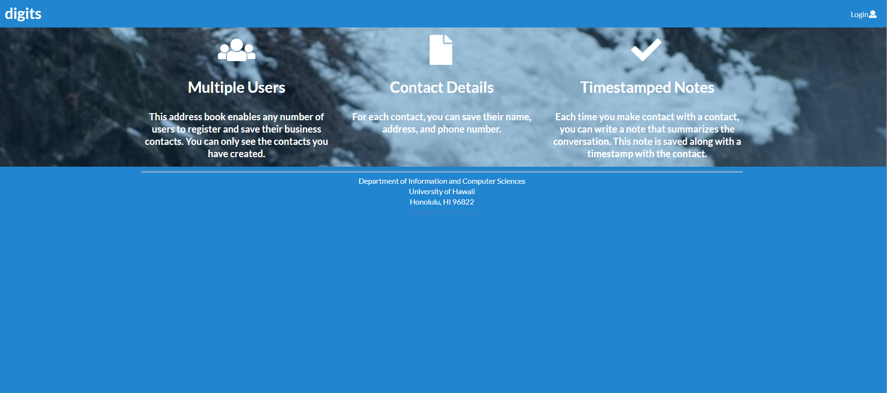
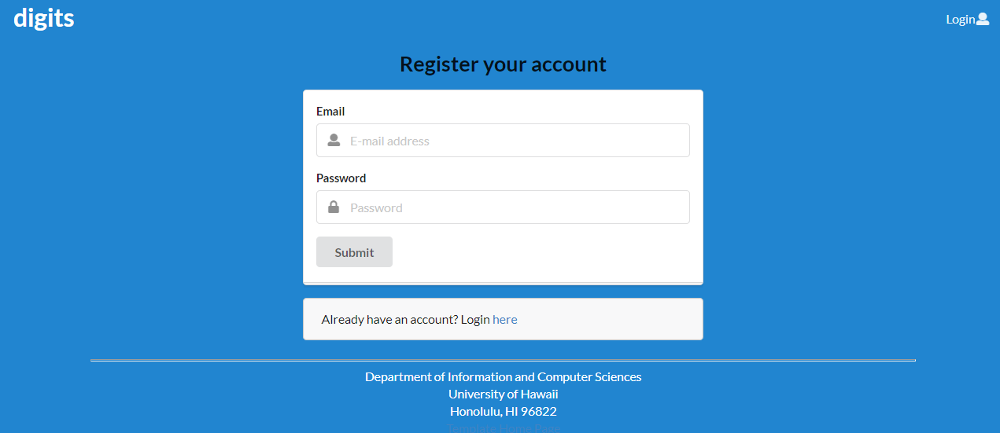
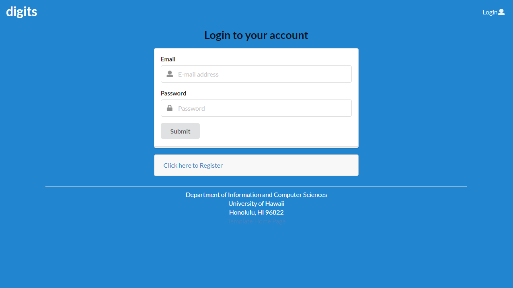
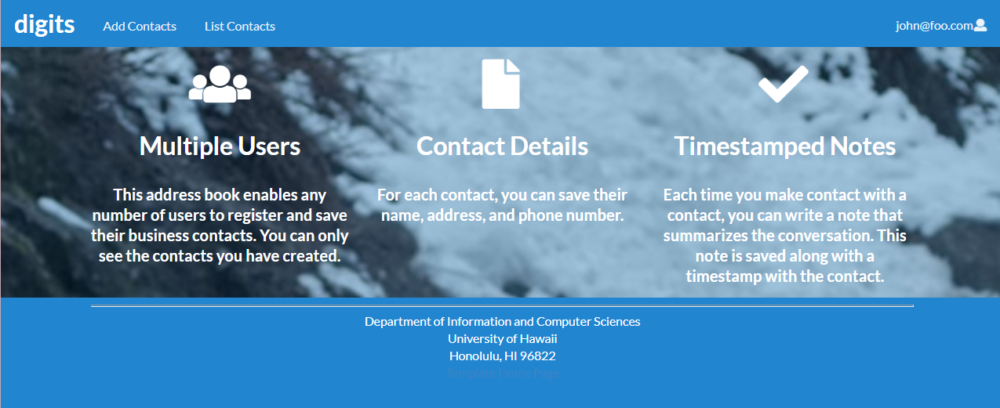
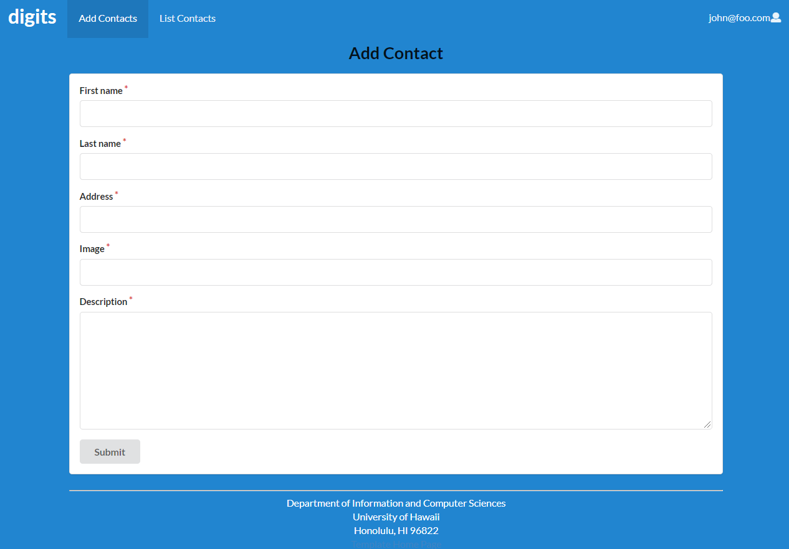
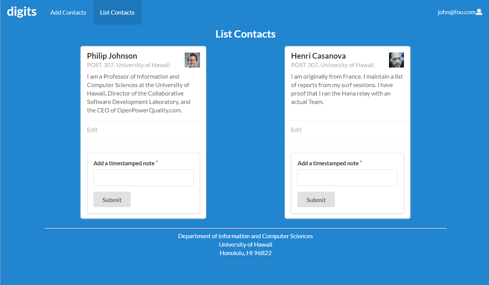
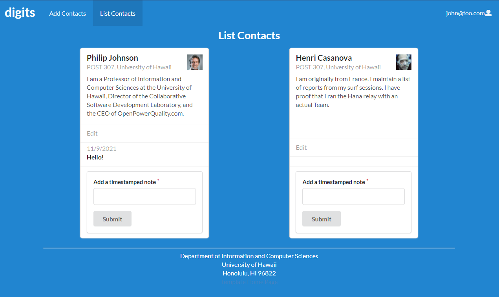
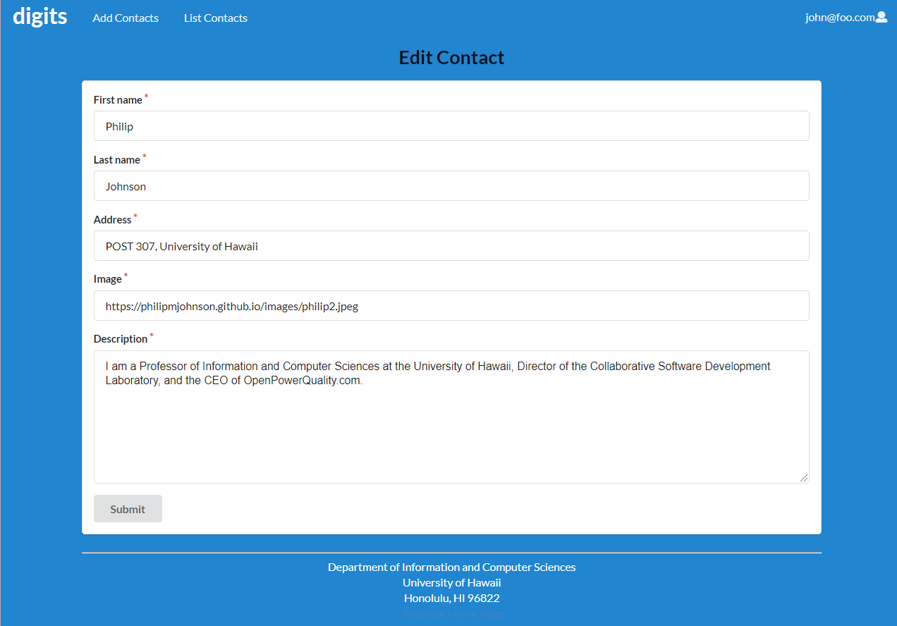
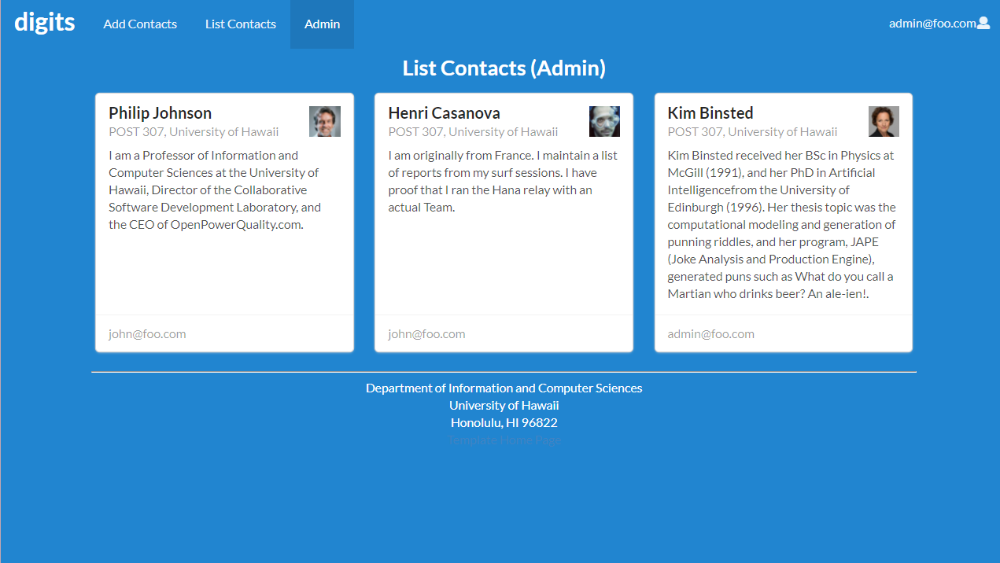

### Overview


Digits is an application used to
* Register and login accounts
* Create and manage your contacts
* Add timestamped notes to your contacts

### Installation

Installation steps are mostly taken from the instructions of index.md in [meteor-application-template-react repository](https://github.com/ics-software-engineering/meteor-application-template-react)

First, [install Meteor](https://www.meteor.com/install).

Second, go to [https://github.com/hovictor2000/digits](https://github.com/hovictor2000/digits), and download the repository.

Third, go to your newly created repository, and click the "Clone or download" button to download your new GitHub repo to your local file system.  Using [GitHub Desktop](https://desktop.github.com/) is a great choice if you use MacOS or Windows.

Fourth, cd into the app/ directory of your local copy of the repo, and install third party libraries with:

```
$ meteor npm install
```

## Running the system

Once the libraries are installed, you can run the application by invoking the "start" script in the [package.json file](https://github.com/ics-software-engineering/meteor-application-template-react/blob/master/app/package.json):

```
$ meteor npm run start
```

The first time you run the app, it will create some default users and contacts. Here is the output:

```
meteor npm run start

> meteor-application-template-react@ start /Users/philipjohnson/github/ics-software-engineering/meteor-application-template-react/app
> meteor --no-release-check --settings ../config/settings.development.json

[[[[[ ~/github/ics-software-engineering/meteor-application-template-react/app ]]]]]

=> Started proxy.
=> Started MongoDB.
I20211109-00:33:29.227(-10)? Creating the default user(s)
I20211109-00:33:29.235(-10)?   Creating user admin@foo.com.
I20211109-00:33:29.322(-10)?   Creating user john@foo.com.
I20211109-00:33:29.402(-10)? Creating default contacts.
I20211109-00:33:29.403(-10)?   Adding: Philip (john@foo.com)
I20211109-00:33:29.419(-10)?   Adding: Henri (john@foo.com)
I20211109-00:33:29.422(-10)?   Adding: Kim (admin@foo.com)
I20211109-00:33:29.454(-10)? Monti APM: completed instrumenting the app
=> Started your app.

=> App running at: http://localhost:3000/
```


### Note regarding "bcrypt warning":

You might also get the following message when you run this application:

```
Note: you are using a pure-JavaScript implementation of bcrypt.
While this implementation will work correctly, it is known to be
approximately three times slower than the native implementation.
In order to use the native implementation instead, run

  meteor npm install --save bcrypt

in the root directory of your application.
```

On some operating systems (particularly Windows), installing bcrypt is much more difficult than implied by the above message. Bcrypt is only used in Meteor for password checking, so the performance implications are negligible until your site has very high traffic. You can safely ignore this warning without any problems during initial stages of development.

### Note regarding "MongoError: not master and slaveOk=false":

Intermittently, you may see the following error message in the console when the system starts up:

```
MongoError: not master and slaveOk=false
     at queryCallback (/Users/philipjohnson/.meteor/packages/npm-mongo/.3.1.1.1mmptof.qcqo++os+web.browser+web.browser.legacy+web.cordova/npm/node_modules/mongodb-core/lib/cursor.js:248:25)
     at /Users/philipjohnson/.meteor/packages/npm-mongo/.3.1.1.1mmptof.qcqo++os+web.browser+web.browser.legacy+web.cordova/npm/node_modules/mongodb-core/lib/connection/pool.js:532:18
     at _combinedTickCallback (internal/process/next_tick.js:131:7)
     at process._tickDomainCallback (internal/process/next_tick.js:218:9)
```

While irritating, this message appears to be harmless and [possibly related to a race condition between the development instance of Mongo and Meteor](https://github.com/meteor/meteor/issues/9026#issuecomment-330850366). By harmless, I mean that in most cases, the console goes on to display `App running at: http://localhost:3000/` and no problems occur during run time.

### Walkthrough

#### Landing Page


When you first bring up the app, you will see a landing page similar to the picture above that gives a brief summary of what Digits can do.

#### Register


If want to make a new account on the system, you can register by clicking "Login" on the top right and then "Sign up."

#### Log in



Click on "Login" on the top right and then "Sign in" to sign in to an account.

#### User landing page



After a successful login, the system will take you to this landing page, similar to the previous one but with links to add contact and list contacts added at the top navigation bar.

#### Add Contacts



Clicking on Add Contacts in the top navigation bar brings you to this page. This page lets you add a new contact to the database. Input their first name, last name, address, description and give a link to an image of them, and then submit the form to add it to the database. Contacts can be viewed in "List Contacts."

#### List Contacts



Clicking on List Contacts in the top navigation bar brings you to this page. This page lists all the contacts associated with the logged in user. 



You can also add notes to each contacts that are timestamped.

#### Edit Contacts



On the List Contacts page, the user can click "Edit" on any card containing a Contact to bring up a page that allow you to edit information about that Contact.

#### Admin mode



Users can be designated as an "Admin" through the settings file (settings.development.json). As an "Admin" they can do everything a normal user can do, but they also get access to a special "Admin" page in the top navigation bar that retrieves all Contacts from all users, and shows the user associated with it.